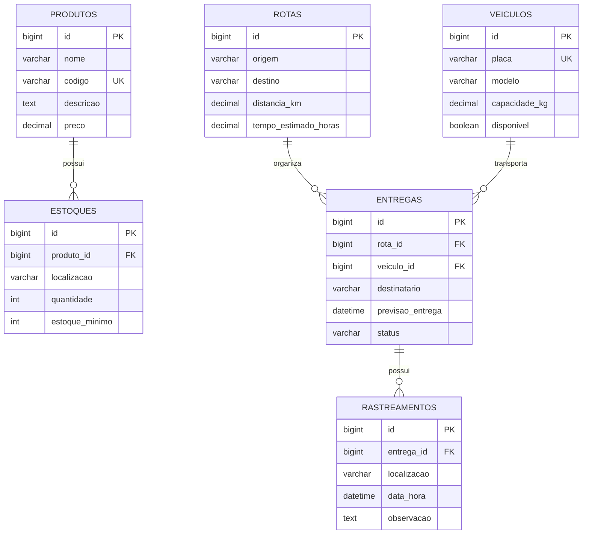

# Modelo de domínio

> No mínimo **3 entidades** e pelo menos **um relacionamento**. As linhas marcadas com *(exemplo)* mostram o nível de detalhe esperado: apague e escreva as do grupo.

## Entidades

Uma tabela por entidade. A coluna **Regra** é o que vira `NOT NULL`, `UNIQUE` ou validação no DTO.

### Produto
Representa um produto armazenado e transportado pela empresa.

| Atributo | Tipo | Coluna | Obrigatório | Regra |
|---|---|---|---|---|
| `id` | `int` | `id` | sim | Gerado pelo banco |
| `nome` | `str` | `nome` | sim | Até 100 caracteres |
| `codigo` | `str` | `codigo` | sim | Até 30 caracteres. Único |
| `descricao` | `str` | `descricao` | não | Texto livre |
| `preco` | `Decimal` | `preco` | sim | Maior ou igual a zero |

### Estoque
Representa a quantidade disponível de um produto em determinado local de armazenamento.

| Atributo | Tipo | Coluna | Obrigatório | Regra |
|---|---|---|---|---|
| `id` | `int` | `id` | sim | Gerado pelo banco |
| `produto_id` | `int` | `produto_id` | sim | Chave estrangeira para produtos(id) |
| `localizacao` | `str` | `localizacao` | sim | Até 100 caracteres |
| `quantidade` | `int` | `quantidade` | sim | Maior ou igual a zero. Valor inicial 0 |
| `estoque_minimo` | `int` | `estoque_minimo` | sim | Maior ou igual a zero. Valor inicial 0 |

### Veiculo
Representa um veículo utilizado no transporte de mercadorias.

| Atributo | Tipo | Coluna | Obrigatório | Regra |
|---|---|---|---|---|
| `id` | `int` | `id` | sim | Gerado pelo banco |
| `placa` | `str` | `placa` | sim | Até 10 caracteres. Única |
| `modelo` | `str` | `modelo` | sim | Até 100 caracteres |
| `capacidade_kg` | `Decimal` | `capacidade_kg` | sim | Maior que zero |
| `disponivel` | `bool` | `disponivel` | sim | Valor inicial True; |

### Rota
Representa um percurso entre uma origem e um destino para a realização de entregas.

| Atributo | Tipo | Coluna | Obrigatório | Regra |
|---|---|---|---|---|
| `id` | `int` | `id` | sim | Gerado pelo banco |
| `origem` | `str` | `origem` | sim | Até 100 caracteres. |
| `destino` | `str` | `destino` | sim | Até 100 caracteres. |
| `distancia_km` | `Decimal` | `distancia_km` | sim | Maior que zero. |
| `tempo_estimado_horas` | `Decimal` | `tempo_estimado_horas` | não | Maior que zero. |


### Entrega
Representa uma entrega de mercadorias destinada a um destinatário, associada a uma rota e a um veículo.

| Atributo | Tipo | Coluna | Obrigatório | Regra |
|---|---|---|---|---|
| `id` | `int` | `id` | sim | Gerado pelo banco |
| `rota_id` | `int` | `rota_id` | sim | Chave estrangeira para Rota(id) |
| `veiculo_id` | `int` | `veiculo_id` | sim | Chave estrangeira para Veiculo(id) |
| `destinatario` | `str` | `destinatario` | sim | Até 100 caracteres |
| `previsao_entrega` | `datetime` | `previsao_entrega` | não | Data e hora válidas |
| `status` | `str` | `status` | sim | Até 100 caracteres; |

### Rastreamento
Representa um registro do histórico de localização e das atualizações de uma entrega.

| Atributo | Tipo | Coluna | Obrigatório | Regra |
|---|---|---|---|---|
| `id` | `int` | `id` | sim | Gerado pelo banco |
| `entrega_id` | `int` | `entrega_id` | sim | Chave estrangeira para entregas(id) |
| `localizacao` | `str` | `localizacao` | sim | Até 200 caracteres |
| `data_hora` | `datetime` | `data_hora` | sim | Data e hora válidas |
| `observacao` | `str` | `observacao` | não | Texto livre |

## Relacionamentos

| De | Para | Tipo | No banco | No código |
|---|---|---|---|---|
| Estoque | Produto | muitos para um | `estoques.produto_id` referencia `produtos(id)` | `ForeignKey(Produto)` em `Estoque` |
| Entrega | Rota | muitos para um | `entregas.rota_id` referencia `rotas(id)` | `ForeignKey(Rota)` em `Entrega` |
| Entrega | Veiculo | muitos para um | `entregas.veiculo_id` referencia `veiculos(id)` | `ForeignKey(Veiculo)` em `Entrega` |
| Rastreamento | Entrega | muitos para um | `rastreamentos.entrega_id ` referencia `entregas(id)` | `ForeignKey(Entrega)` em `Rastreamento` |

## Diagrama ER

O GitHub desenha o bloco abaixo sozinho. Troque pelas tabelas do grupo, com os nomes das colunas como estarão no banco (`snake_case`).



Como ler: ||--o{ representa um relacionamento de um para muitos. Um produto pode possuir zero ou vários registros de estoque, e cada registro de estoque pertence a exatamente um produto.

## Migrations


**Em desenvolvimento, o trecho abaixo irá permanecer para ser utilizado como base de preenchimento futura**<br>
```
Todas existem em `src/main/resources/db/migration`, uma tabela por arquivo. A ordem importa: a tabela referenciada nasce antes da que referencia.

| Versão | Arquivo | O que cria |
|---|---|---|
| V1 *(exemplo)* | `V1__criar_livros.sql` | Tabela `livros` |
| V2 *(exemplo)* | `V2__criar_leitores.sql` | Tabela `leitores` |
| V3 *(exemplo)* | `V3__criar_emprestimos.sql` | Tabela `emprestimos`, com as duas chaves estrangeiras |
```
